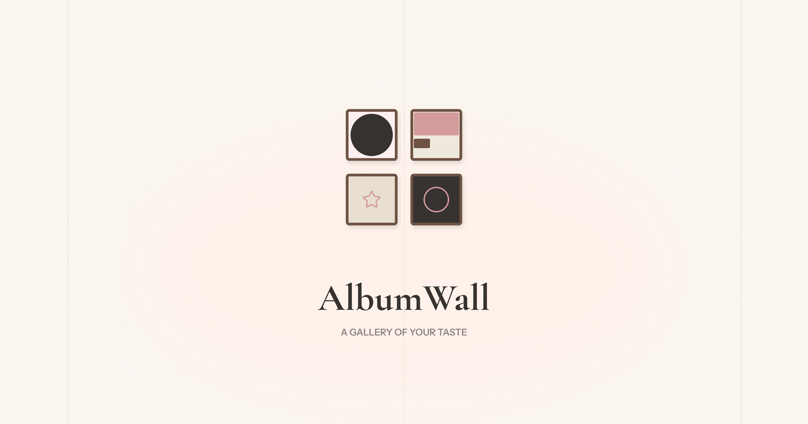
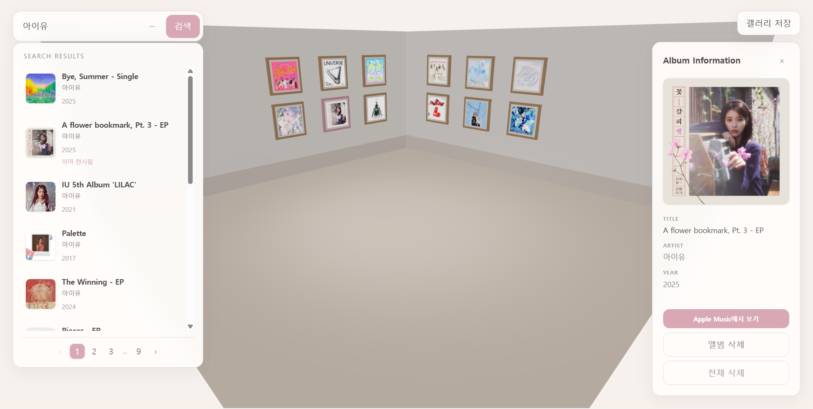

# AlbumWall

<p align="center">
  
</p>

좋아하는 앨범을 나만의 3D 갤러리에 전시하고
음악 취향을 시각적으로 기록하는 웹 애플리케이션입니다.

🔗 [Live Demo](https://album-wall-gallery.vercel.app/)

## Preview

<p align="center">
  
</p>

## Features

### 🎵 Album Search

iTunes Search API를 활용하여 앨범과 아티스트를 검색할 수 있습니다.

### 🖼️ 3D Album Gallery

React Three Fiber와 Three.js를 활용해
앨범을 3D 공간의 액자에 전시할 수 있습니다.

### 💾 Local Storage

전시한 앨범을 LocalStorage에 저장하여
페이지를 새로고침해도 갤러리 상태가 유지됩니다.

### 📸 Gallery Export

완성된 3D 갤러리를 JPEG 이미지로 저장할 수 있습니다.

## Tech Stack

### Frontend

- React
- TypeScript
- React Three Fiber
- Three.js
- Tailwind CSS
- Vite

### Backend

- Express
- iTunes Search API

### Deployment

- Vercel

## Development

### Installation

```bash
npm install
```

### Run

```bash
npm run dev
```

## Project Structure

    src/
    ├── api/
    ├── components/
    ├── scene/
    ├── types/
    └── App.tsx

    server/
    └── index.js

## Deployment

Vercel을 이용하여 프론트엔드와 API를 배포했습니다.

## Future Plans

- [ ] 로그인 및 사용자별 갤러리 저장
- [ ] 월별 갤러리 저장
- [ ] 과거 갤러리를 통한 음악 취향 변화 확인
- [ ] 3D 갤러리 디자인 개선
- [ ] 반응형 UI 개선
